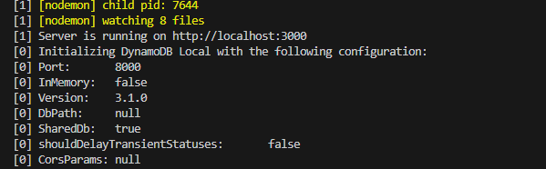

# Event Link Backend (Express + TypeScript + DynamoDB Local)

This repository contains a Todo list backend implemented with Express and TypeScript, integrated with AWS DynamoDB. It supports running locally against DynamoDB Local and can be deployed to AWS Lambda using Serverless.

## Prerequisites

- Node.js (>= 18) and npm
- Java (JRE) 8 or later (only required if running DynamoDB Local via the JAR)
- NoSQL Workbench or dynamodb-admin (to inspect the local DynamoDB data)

## How to run
```bash
npm run dev
```

This command starts DynamoDB Local and the Express server with hot reload, so you do not need to restart the server between changes.

Wait until you see both `Server is running on` and `Initializing DynamoDB Local` before using the API.



## Setup steps

### Install dependencies
```bash
npm install
```

### Java install and PATH (Windows)
1. Download and install Java(TM) SE Development Kit from Company Portal.
2. Add `java` to your PATH (Windows):
   - Open System Properties -> Advanced -> Environment Variables.
   - Edit `Path` and add `C:\Program Files\Java\jdk-<version>\bin` (adjust the path to your install).
   - Open a new terminal and run `java -version` to verify.

### AWS CLI and credentials
Although the project runs locally, DynamoDB Local expects credentials.

1. Install AWS Command Line Interface from Company Portal.
2. Configure dummy credentials:
   ```bash
   aws configure
   ```
3. Provide the following values:
   ```
   AWS_ACCESS_KEY_ID=myAccessKey
   AWS_SECRET_ACCESS_KEY=mySecretKey
   AWS_REGION=ap-southeast-1
   ```
   Press Enter to skip the remaining prompts.

### DynamoDB Local setup
1. Download [NoSQL Workbench](https://docs.aws.amazon.com/amazondynamodb/latest/developerguide/workbench.settingup.html) to inspect local DynamoDB data (recommended).
   - Create a connection in Operation builder.
   - Choose the DynamoDB local tab.
   - Hostname `localhost`, port `8000`.
2. Alternatively use [dynamodb-admin](https://www.npmjs.com/package/dynamodb-admin/v/1.12.0):
   ```bash
   export AWS_ACCESS_KEY_ID=myAccessKey
   export AWS_SECRET_ACCESS_KEY=mySecretKey
   export DYNAMO_ENDPOINT=http://localhost:8000
   dynamodb-admin
   ```
3. Start DynamoDB Local (only needed once; `npm run dev` handles this afterwards):
   ```bash
   npm run dynamo:local
   ```
4. Create the `todos` table:
   ```bash
   npm run db:init
   ```
5. Verify the local table:
   ```bash
   aws dynamodb scan --table-name todos --endpoint-url http://localhost:8000 --region ap-southeast-1
   ```

## Troubleshooting

- `EADDRINUSE: port 3000 in use` -> set the `PORT` environment variable or stop the process using the port.
- `UnrecognizedClientException` -> credentials invalid; run `aws sts get-caller-identity` to verify.
- `Table not found` -> ensure the table exists locally or set `TODOS_TABLE` to the correct name.

## Deployment (AWS Lambda + DynamoDB)
- Use the CodeBuild configuration in `backend-buildspec.yml` to compile TypeScript, prune dev dependencies, and package the Lambda artifact (`backend.zip`). Configure the project with the `aws/codebuild/standard:7.0` image and an S3 artifact bucket.
- Deploy the packaged artifact with the SAM template `backend-sam-template.yaml`. In CodePipeline, add a CloudFormation deploy stage that points to this template and passes `EnvironmentName`, `ArtifactBucket`, and `ArtifactKey` parameters from the build output.
- The SAM stack provisions the DynamoDB table `<env>-event-link-todos`, an HTTP API that forwards `ANY /` and `ANY /{proxy+}` to the Lambda function, and configures Canary 10%/5m CodeDeploy deployments via the `live` alias.
- Expose the stack output `ApiEndpoint` to the frontend by setting its `VITE_API_BASE_URL` environment variable.
- Add Parameter Store or Secrets Manager entries for any environment-specific settings you do not want in source control, and reference them from your runtime configuration as needed.
